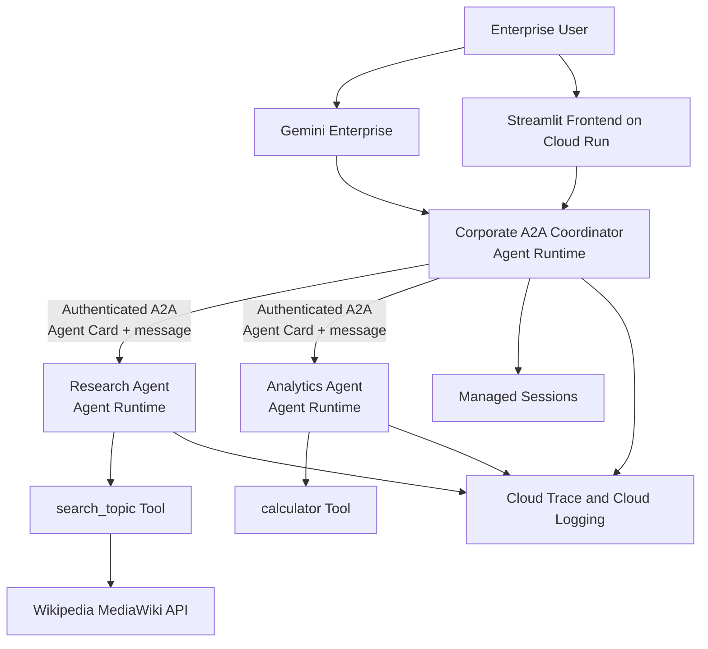
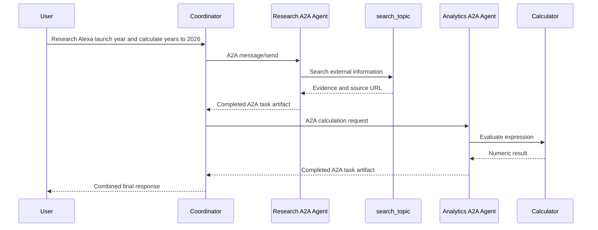

# Corporate A2A Multi-Agent System on Google Cloud

A production-oriented multi-agent application built with Google Agent Development Kit (ADK), the Agent2Agent (A2A) protocol, Gemini models, and Gemini Enterprise Agent Platform.

The solution deploys research and analytics specialists as independent A2A Agent Runtime services. A coordinator agent discovers and invokes those specialists through authenticated A2A calls. The coordinator can then be consumed from a custom Streamlit frontend or registered with Gemini Enterprise.

> **Status:** End-to-end A2A communication, authenticated Agent Runtime calls, managed tracing, and specialist tool execution have been validated.
>
> **Important:** A2A support in ADK and Agent Runtime is currently Preview or Experimental. Pin the dependency versions validated in your environment before using this pattern in production.

---

## 1. Why This Architecture Is Needed

The original implementation embedded the coordinator and all specialist agents inside one ADK application:

```text
Single Agent Runtime
└── coordinator_agent
    ├── research_agent
    │   └── search_topic
    └── analytics_agent
        └── calculator
```

That is a valid ADK multi-agent design, but communication occurs through internal ADK agent transfer. It is not a remote A2A call.

The A2A version deploys each specialist independently:

```text
Coordinator Agent Runtime
├── Authenticated A2A call -> Research Agent Runtime
│                              └── search_topic
└── Authenticated A2A call -> Analytics Agent Runtime
                               └── calculator
```

This design is useful because it provides:

- Independent deployment and versioning for each specialist
- Independent scaling and failure boundaries
- Agent discovery through Agent Cards
- Standardized remote agent communication through A2A
- Separate IAM identities and authorization policies
- Independent logs, metrics, and traces
- Reuse of specialists by other orchestrators
- Centralized access through Gemini Enterprise or a custom frontend

---

## 2. End-to-End Architecture



### Request flow for a mixed question



---

## 3. Folder Structure

```text
corporate-a2a-system/
├── coordinator_agent/
│   ├── __init__.py
│   ├── agent.py
│   ├── auth.py
│   ├── deploy.py
│   └── requirements.txt
│
├── research_agent/
│   ├── __init__.py
│   ├── agent.py
│   ├── tools.py
│   ├── agent_card.py
│   ├── executor.py
│   ├── a2a_app.py
│   ├── deploy.py
│   └── requirements.txt
│
├── analytics_agent/
│   ├── __init__.py
│   ├── agent.py
│   ├── tools.py
│   ├── agent_card.py
│   ├── executor.py
│   ├── a2a_app.py
│   ├── deploy.py
│   └── requirements.txt
│
└── test_research_a2a.py
```

---

## 4. Purpose of Every File

### Coordinator Agent

#### `coordinator_agent/__init__.py`

Marks the directory as a Python package. Keep this file lightweight so the deployment script can set environment variables before importing `agent.py`.

Recommended content:

```python
"""Corporate A2A coordinator package."""
```

Do not automatically import `root_agent` here because `agent.py` requires Agent Card environment variables.

#### `coordinator_agent/agent.py`

Defines:

- The user-facing coordinator agent
- The remote Research A2A proxy
- The remote Analytics A2A proxy
- Routing instructions
- The list of remote sub-agents

The specialists are represented by `RemoteA2aAgent`, not by local ADK `Agent` objects.

#### `coordinator_agent/auth.py`

Provides Google Cloud OAuth authentication for outbound A2A calls. It obtains credentials from Application Default Credentials and adds:

```http
Authorization: Bearer ACCESS_TOKEN
```

The HTTP client must remain serializable during `agent_engines.create()`. A normal global `httpx.AsyncClient` contains an internal thread lock and can cause:

```text
TypeError: cannot pickle '_thread.RLock' object
```

Use a serialization-safe client implementation or an ADK version that lazily creates the remote client.

#### `coordinator_agent/deploy.py`

- Sets Research and Analytics Agent Card URLs
- Makes the URLs available during local serialization
- Passes the same variables to the remote runtime
- Wraps the coordinator in `AdkApp`
- Deploys the coordinator with `agent_engines.create()`
- Optionally assigns a dedicated runtime service account

#### `coordinator_agent/requirements.txt`

Defines dependencies installed inside the remote coordinator runtime.

---

### Research Agent

#### `research_agent/__init__.py`

Exports the research `root_agent` and marks the folder as a Python package.

#### `research_agent/agent.py`

Defines the research specialist, Gemini model, instructions, and `search_topic` tool.

The remote specialist must return its final result through the A2A task. It should not call `transfer_to_agent("coordinator_agent")`.

#### `research_agent/tools.py`

Calls the Wikipedia MediaWiki API and returns structured evidence.

The request must include an informative `User-Agent` header. Wikimedia may reject missing or generic clients with HTTP 403.

#### `research_agent/agent_card.py`

Declares the research specialist's A2A metadata:

- Agent name
- Description
- Skill ID
- Skill name
- Tags
- Example prompts
- Supported protocol information

#### `research_agent/executor.py`

Bridges the A2A protocol to the ADK Runner:

```text
A2A request
-> AgentExecutor
-> ADK Runner
-> Research Agent
-> search_topic Tool
-> Final ADK event
-> A2A task artifact
```

#### `research_agent/a2a_app.py`

Combines the Agent Card and executor into a deployable `A2aAgent`.

#### `research_agent/deploy.py`

Packages and deploys the independent Research A2A Agent Runtime.

#### `research_agent/requirements.txt`

Includes ADK, Agent Runtime, A2A HTTP server dependencies, `sse-starlette`, and the tool dependencies.

---

### Analytics Agent

#### `analytics_agent/agent.py`

Defines the mathematics and analytics specialist.

#### `analytics_agent/tools.py`

Contains a safe arithmetic evaluator based on Python AST. Avoid using `eval()`.

#### `analytics_agent/agent_card.py`

Advertises the calculation skill to A2A clients.

#### `analytics_agent/executor.py`

Converts A2A tasks into ADK analytics-agent executions.

#### `analytics_agent/a2a_app.py`

Creates the deployable Analytics `A2aAgent`.

#### `analytics_agent/deploy.py`

Deploys the Analytics specialist to its own Agent Runtime.

#### `analytics_agent/requirements.txt`

Contains the server-side A2A and analytics runtime dependencies.

---

## 5. Prerequisites

You need:

- A Google Cloud project with billing enabled
- Cloud Shell or a Linux development environment
- Python 3.10 or newer
- Permission to enable APIs and manage IAM
- A Cloud Storage bucket for deployment staging
- Vertex AI and Agent Platform access
- Google Cloud Application Default Credentials for local tests

Set the project:

```bash
export PROJECT_ID="project-c11bffff-09d9-480a-a53"
export LOCATION="us-central1"

gcloud config set project "${PROJECT_ID}"
```

---

## 6. Enable Required APIs

```bash
gcloud services enable \
  aiplatform.googleapis.com \
  telemetry.googleapis.com \
  cloudtrace.googleapis.com \
  logging.googleapis.com \
  monitoring.googleapis.com \
  iamcredentials.googleapis.com \
  cloudresourcemanager.googleapis.com \
  --project="${PROJECT_ID}"
```

### Why these APIs are required

- `aiplatform.googleapis.com`: Deploys and invokes Agent Runtime resources
- `telemetry.googleapis.com`: Receives OpenTelemetry traces, logs, and metrics
- `cloudtrace.googleapis.com`: Stores and displays distributed traces
- `logging.googleapis.com`: Stores runtime, build, stdout, and stderr logs
- `monitoring.googleapis.com`: Stores runtime metrics
- `iamcredentials.googleapis.com`: Supports workload identity and token operations
- `cloudresourcemanager.googleapis.com`: Supports project and IAM operations

---

## 7. Create a Project-Level Virtual Environment

Create one virtual environment at the project root. Do not maintain separate `.venv` directories inside deployable agent folders.

```bash
cd ~/corporate-a2a-system

python3 -m venv .venv
source .venv/bin/activate

python -m pip install --upgrade pip
```

Verify:

```bash
which python
```

Expected pattern:

```text
/home/USER/corporate-a2a-system/.venv/bin/python
```

---

## 8. Create Staging Buckets

Cloud Storage is used to stage serialized agent objects, requirements, and local packages before Agent Runtime deployment.

```bash
export RESEARCH_BUCKET="gs://${PROJECT_ID}-research-a2a-staging"
export ANALYTICS_BUCKET="gs://${PROJECT_ID}-analytics-a2a-staging"
export COORDINATOR_BUCKET="gs://${PROJECT_ID}-coordinator-a2a-staging"
```

Create the buckets:

```bash
gcloud storage buckets create "${RESEARCH_BUCKET}" \
  --project="${PROJECT_ID}" \
  --location="${LOCATION}" \
  --uniform-bucket-level-access

gcloud storage buckets create "${ANALYTICS_BUCKET}" \
  --project="${PROJECT_ID}" \
  --location="${LOCATION}" \
  --uniform-bucket-level-access

gcloud storage buckets create "${COORDINATOR_BUCKET}" \
  --project="${PROJECT_ID}" \
  --location="${LOCATION}" \
  --uniform-bucket-level-access
```

Update the corresponding `STAGING_BUCKET` values in each `deploy.py`.

---

## 9. Dependency Files

### Research and Analytics server requirements

Use A2A HTTP server extras because both specialists host A2A services:

```text
google-cloud-aiplatform[agent_engines,adk]>=1.153.0
google-adk[a2a,agent-identity]>=2.6.0
a2a-sdk[http-server]>=1.0.0
sse-starlette>=2.1.0
cloudpickle>=3.0.0
requests>=2.32.0
pydantic>=2.6.4
```

The `sse-starlette` dependency is important. Without it, the deployed A2A server may fail at startup with:

```text
No module named 'sse_starlette'
```

### Coordinator requirements

```text
google-cloud-aiplatform[agent_engines,adk]>=1.153.0
google-adk[a2a,agent-identity]>=2.6.0
a2a-sdk>=1.0.0
cloudpickle>=3.0.0
httpx>=0.27.0
google-auth>=2.0.0
pydantic>=2.6.4
```

The coordinator consumes A2A services but does not host an A2A HTTP server, so `sse-starlette` is normally unnecessary for the coordinator.

### Install dependencies locally

```bash
python -m pip install -r research_agent/requirements.txt
python -m pip install -r analytics_agent/requirements.txt
python -m pip install -r coordinator_agent/requirements.txt
```

After validation, pin exact versions to avoid local and remote dependency drift.

---

## 10. Deploy the Analytics A2A Agent

Always run module deployments from the project root:

```bash
cd ~/corporate-a2a-system
python -m analytics_agent.deploy
```

Do not run:

```bash
cd analytics_agent
python deploy.py
```

Running from the project root allows Python to resolve imports such as:

```python
from analytics_agent.agent import root_agent
```

Save the returned resource name:

```text
projects/PROJECT_ID/locations/us-central1/reasoningEngines/ANALYTICS_ID
```

---

## 11. Deploy the Research A2A Agent

```bash
python -m research_agent.deploy
```

Save the resource name:

```text
projects/PROJECT_ID/locations/us-central1/reasoningEngines/RESEARCH_ID
```

### Research tool User-Agent requirement

Use an informative header when calling Wikimedia:

```python
HEADERS = {
    "User-Agent": (
        "CorporateA2AResearchAgent/1.0 "
        "(contact: ai-platform-support@example.com)"
    ),
    "Accept": "application/json",
}
```

Replace the contact address with a monitored organizational mailbox.

---

## 12. Test a Specialist Through the Agent Platform SDK

The specialist Preview Playground can call an incorrectly encoded route in some versions. The reliable test method is the Agent Platform SDK.

Install the SDK:

```bash
python -m pip install --upgrade \
  "google-cloud-agentplatform[a2a,adk,agent_engines]"
```

### Typed A2A request example

```python
import asyncio

import agentplatform

from a2a.client import ClientCallContext
from a2a.helpers import new_text_message
from a2a.types import Role, SendMessageRequest


PROJECT_ID = "project-c11bffff-09d9-480a-a53"
LOCATION = "us-central1"
RESOURCE_ID = "RESEARCH_ID"

RESOURCE_NAME = (
    f"projects/{PROJECT_ID}/"
    f"locations/{LOCATION}/"
    f"reasoningEngines/{RESOURCE_ID}"
)


async def main():
    client = agentplatform.Client(
        project=PROJECT_ID,
        location=LOCATION,
        http_options={
            "api_version": "v1beta1",
            "timeout": 120000,
        },
    )

    remote_agent = client.runtimes.get(
        name=RESOURCE_NAME
    )

    user_role = getattr(
        Role,
        "ROLE_USER",
        getattr(Role, "USER", None),
    )

    message = new_text_message(
        "Research Amazon Alexa and identify its original release year.",
        role=user_role,
    )

    request = SendMessageRequest(
        message=message
    )

    context = ClientCallContext()

    response = await remote_agent.on_message_send(
        request=request,
        context=context,
    )

    print(response)


asyncio.run(main())
```

A successful response contains:

```text
state: TASK_STATE_COMPLETED
artifacts:
  name: result
  parts:
    text: ...
```

---

## 13. Create the Coordinator Service Account

A dedicated coordinator identity is recommended because the coordinator performs machine-to-machine calls to specialist Agent Runtimes.

```bash
export COORDINATOR_SA="corporate-a2a-coordinator@${PROJECT_ID}.iam.gserviceaccount.com"

gcloud iam service-accounts create corporate-a2a-coordinator \
  --project="${PROJECT_ID}" \
  --display-name="Corporate A2A Coordinator"
```

Grant Agent Runtime invocation access:

```bash
gcloud projects add-iam-policy-binding "${PROJECT_ID}" \
  --member="serviceAccount:${COORDINATOR_SA}" \
  --role="roles/aiplatform.user"
```

Grant telemetry permissions:

```bash
gcloud projects add-iam-policy-binding "${PROJECT_ID}" \
  --member="serviceAccount:${COORDINATOR_SA}" \
  --role="roles/telemetry.writer"

gcloud projects add-iam-policy-binding "${PROJECT_ID}" \
  --member="serviceAccount:${COORDINATOR_SA}" \
  --role="roles/serviceusage.serviceUsageConsumer"

gcloud projects add-iam-policy-binding "${PROJECT_ID}" \
  --member="serviceAccount:${COORDINATOR_SA}" \
  --role="roles/cloudtrace.agent"
```

Allow the current user to deploy a runtime as this service account:

```bash
export DEPLOYER_EMAIL="$(
  gcloud auth list \
    --filter=status:ACTIVE \
    --format='value(account)'
)"

gcloud iam service-accounts add-iam-policy-binding \
  "${COORDINATOR_SA}" \
  --project="${PROJECT_ID}" \
  --member="user:${DEPLOYER_EMAIL}" \
  --role="roles/iam.serviceAccountUser"
```

---

## 14. Agent Card URLs

Agent Runtime does not provide a normal public `/.well-known/agent-card.json` endpoint. The coordinator uses authenticated Agent Runtime card endpoints.

Pattern:

```text
https://LOCATION-aiplatform.googleapis.com/v1beta1/
projects/PROJECT_NUMBER/locations/LOCATION/
reasoningEngines/RESOURCE_ID/a2a/v1/card
```

Research example:

```text
https://us-central1-aiplatform.googleapis.com/v1beta1/projects/PROJECT_NUMBER/locations/us-central1/reasoningEngines/RESEARCH_ID/a2a/v1/card
```

Analytics example:

```text
https://us-central1-aiplatform.googleapis.com/v1beta1/projects/PROJECT_NUMBER/locations/us-central1/reasoningEngines/ANALYTICS_ID/a2a/v1/card
```

These endpoints require an OAuth bearer token.

---

## 15. Coordinator Environment Variables

The coordinator deploy script needs the Agent Card URLs in two places.

```python
card_env = {
    "RESEARCH_AGENT_CARD_URL": "RESEARCH_CARD_URL",
    "ANALYTICS_AGENT_CARD_URL": "ANALYTICS_CARD_URL",
    "GOOGLE_CLOUD_AGENT_ENGINE_ENABLE_TELEMETRY": "true",
    "OTEL_SEMCONV_STABILITY_OPT_IN": (
        "gen_ai_latest_experimental"
    ),
}
```

Make them available while the local process imports and serializes `agent.py`:

```python
os.environ.update(card_env)
```

Then pass them to the deployed runtime:

```python
env_vars=card_env
```

Why both are required:

```text
os.environ.update(card_env)
-> Required during local import and serialization

env_vars=card_env
-> Required inside the deployed Agent Runtime
```

---

## 16. Validate Coordinator Serialization

Before deploying, verify that the complete `AdkApp` can be deep-copied:

```bash
export RESEARCH_AGENT_CARD_URL="RESEARCH_CARD_URL"
export ANALYTICS_AGENT_CARD_URL="ANALYTICS_CARD_URL"

python - <<'PY'
import copy

from coordinator_agent.agent import root_agent
from vertexai.agent_engines import AdkApp

app = AdkApp(agent=root_agent)
copy.deepcopy(app)

print("SUCCESS: coordinator app is serializable")
PY
```

Do not deploy until this succeeds.

---

## 17. Deploy the Coordinator

```bash
python -m coordinator_agent.deploy
```

Save the coordinator resource:

```text
projects/PROJECT_ID/locations/us-central1/reasoningEngines/COORDINATOR_ID
```

The coordinator should be configured with:

```python
service_account=COORDINATOR_SERVICE_ACCOUNT
```

---

## 18. End-to-End Test Prompts

### Research only

```text
Use the research agent to research Amazon Alexa and summarize the findings.
```

### Analytics only

```text
Use the analytics agent to calculate (1250 * 18.5) / 100.
```

Expected result:

```text
231.25
```

### Sequential A2A flow

```text
Research the original release year of Amazon Alexa and calculate how many years passed between that year and 2026.
```

Expected execution:

```text
Coordinator
├── A2A call to Research Agent
│   └── search_topic
├── A2A call to Analytics Agent
│   └── calculator
└── Combined response
```

---

## 19. Observability

Use:

```text
Agent Platform
-> Deployments
-> Select deployment
-> Traces
```

### Coordinator trace

```text
invoke_agent coordinator_agent
├── generate_content
├── remote A2A research delegation
├── remote A2A analytics delegation
└── generate_content
```

### Research trace

```text
A2A request
└── invoke_agent research_agent
    ├── generate_content
    ├── execute_tool search_topic
    └── generate_content
```

### Analytics trace

```text
A2A request
└── invoke_agent analytics_agent
    ├── generate_content
    ├── execute_tool calculator
    └── generate_content
```

Enable telemetry during every deployment:

```python
env_vars={
    "GOOGLE_CLOUD_AGENT_ENGINE_ENABLE_TELEMETRY": "true",
    "OTEL_SEMCONV_STABILITY_OPT_IN": (
        "gen_ai_latest_experimental"
    ),
}
```

---

## 20. Register the Coordinator with Gemini Enterprise

Register only the coordinator as the main enterprise-facing agent.

```text
Gemini Enterprise
-> Select app
-> Agents
-> Add agent
-> Custom agent via Agent Runtime
```

Use:

```text
projects/PROJECT_NUMBER/locations/us-central1/reasoningEngines/COORDINATOR_ID
```

Gemini Enterprise becomes the managed user channel, while the specialists remain backend A2A services.

---

## 21. Connect the Streamlit Frontend

Update the frontend to retrieve the deployed coordinator:

```python
from vertexai import agent_engines

RESOURCE_NAME = (
    "projects/PROJECT_NUMBER/locations/us-central1/"
    "reasoningEngines/COORDINATOR_ID"
)

remote_agent = agent_engines.get(
    RESOURCE_NAME
)
```

Do not point Streamlit directly to the Research or Analytics agents unless the UI intentionally exposes those specialists separately.

---

## 22. Troubleshooting Guide

### `ModuleNotFoundError: No module named 'analytics_agent'`

Cause: Deployment was run inside the agent folder.

Fix:

```bash
cd ~/corporate-a2a-system
python -m analytics_agent.deploy
```

### `ModuleNotFoundError: No module named 'common'`

Cause: `executor.py` imports a shared package that does not exist in the selected folder structure.

Fix: Keep the complete executor implementation inside each specialist's `executor.py` or package the shared folder explicitly.

### `No module named 'sse_starlette'`

Cause: The A2A HTTP server dependencies were not installed remotely.

Fix:

```text
a2a-sdk[http-server]>=1.0.0
sse-starlette>=2.1.0
```

### `TypeError: cannot pickle '_thread.RLock' object`

Cause: A global `httpx.AsyncClient` was created before `agent_engines.create()` serialized the coordinator.

Fix:

- Use ADK with lazy RemoteA2aAgent client initialization
- Do not inject a normal global `httpx.AsyncClient`
- Or use a serialization-safe client implementation
- Validate with `copy.deepcopy(AdkApp(...))`

### `401 Unauthorized` on `/a2a/v1/card`

Cause: No OAuth bearer token was sent.

Fix: Use Google ADC authentication and an authenticated HTTP client.

### `403 Forbidden` on `/a2a/v1/card`

Cause: The coordinator identity is authenticated but lacks permission.

Fix:

```bash
gcloud projects add-iam-policy-binding "${PROJECT_ID}" \
  --member="serviceAccount:${COORDINATOR_SA}" \
  --role="roles/aiplatform.user"
```

### Wikipedia API returns `403 Forbidden`

Cause: Missing or generic `User-Agent` header.

Fix: Send a descriptive application User-Agent with contact information.

### Specialist Playground returns `message%3Asend` 404

Cause: The Preview Playground encoded the `:` in the route.

Fix: Test the A2A specialist through the Agent Platform SDK using `on_message_send()` or test it through the coordinator.

### `KeyError: 'request'`

Cause: The generated SDK operation expects explicit `request` and `context` arguments.

Fix: Pass both arguments.

### `'dict' object has no attribute 'configuration'`

Cause: `request` was passed as a dictionary.

Fix: Pass a typed A2A `SendMessageRequest` and `ClientCallContext`.

### Staging upload `TimeoutError`

Cause: Cloud Shell or Cloud Storage upload timed out while staging `extra_packages`.

Fix:

- Retry after verifying bucket access
- Remove `.venv`, `__pycache__`, `.pyc`, logs, and archives from deployable folders
- Keep `extra_packages` small
- Test the staging bucket with `gcloud storage cp`

---

## 23. Production Recommendations

- Pin exact package versions validated together
- Use separate dev, test, and production projects or runtimes
- Use dedicated least-privilege service accounts
- Replace in-memory specialist sessions with a durable managed session service
- Add retries and timeouts for external APIs
- Add rate limiting and caching for research tools
- Implement Model Armor and tool input validation
- Store secrets in Secret Manager
- Add structured logs with trace and task IDs
- Monitor all three runtimes independently
- Delete failed and obsolete deployments
- Use a durable human-approval system before adding an Approval A2A Agent

---

## 24. Final Validated Flow

```text
User
-> Gemini Enterprise or Streamlit
-> Corporate A2A Coordinator
-> Authenticated Agent Card retrieval
-> Typed A2A SendMessageRequest
-> Research or Analytics Agent Runtime
-> Specialist ADK Runner
-> Tool execution
-> A2A TASK_STATE_COMPLETED
-> Result artifact
-> Coordinator final answer
```

This project demonstrates genuine distributed A2A communication. The specialists are independently deployed services, and the coordinator invokes them through authenticated Agent Runtime A2A endpoints rather than internal ADK transfer alone.
